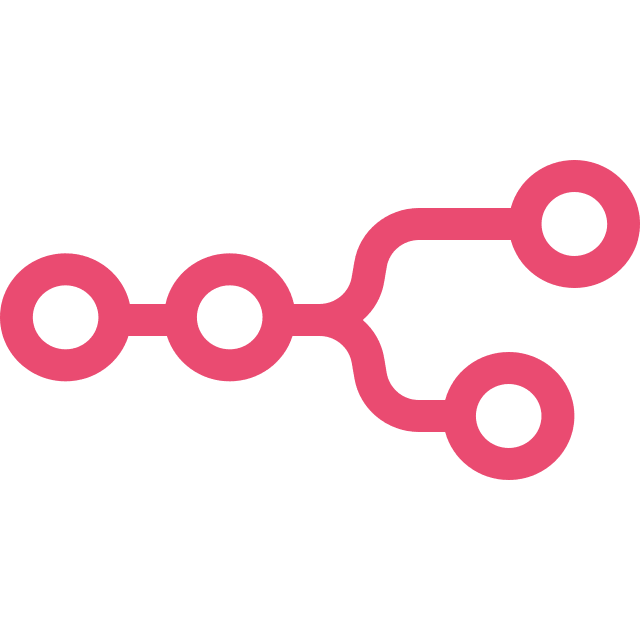
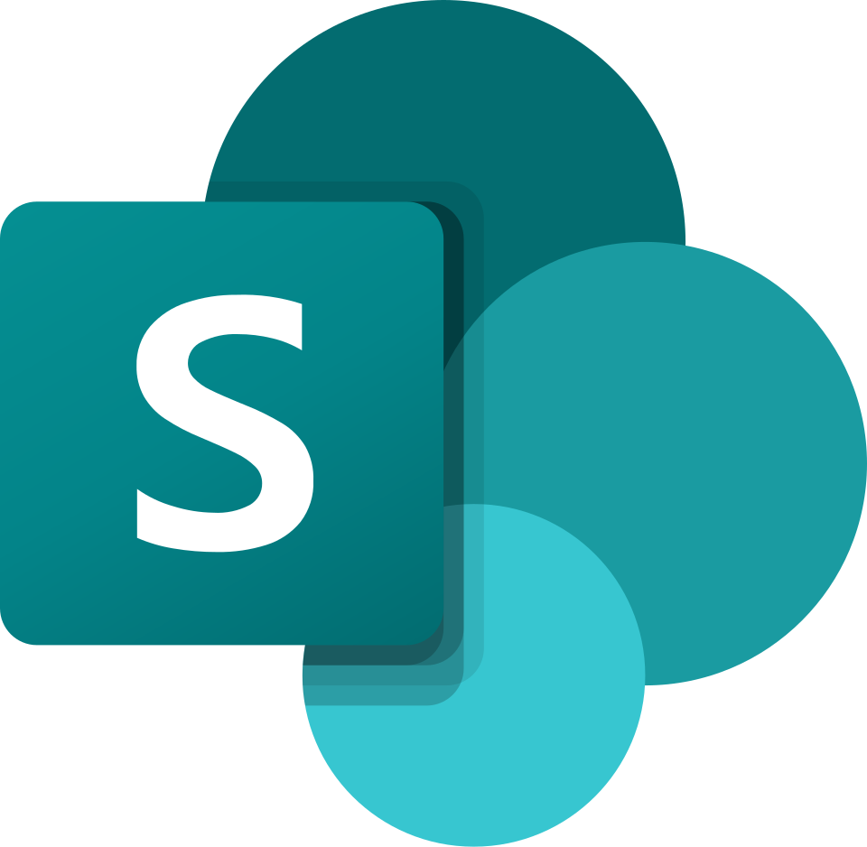

# Hi, I’m Richard 👋

I’m a developer who enjoys building **web projects** and **automation tools** that make everyday work easier. 🚀  

###
<h2 align="left">Tech Stack</h2>

  
  
  
  

###
<h2 align="left">Tools</h2>

  
  
  
  
  
  
  

###
<h2 align="left">Process Automation</h2>

  

<h4 align="left">Microsoft Process Automation</h4>

  
  
  
  
  

###
<h2 align="left">Social Media</h2>

  

